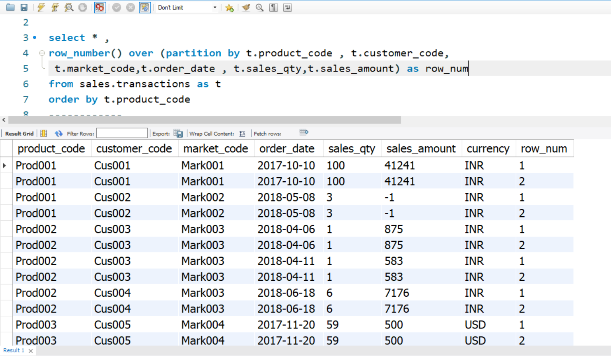
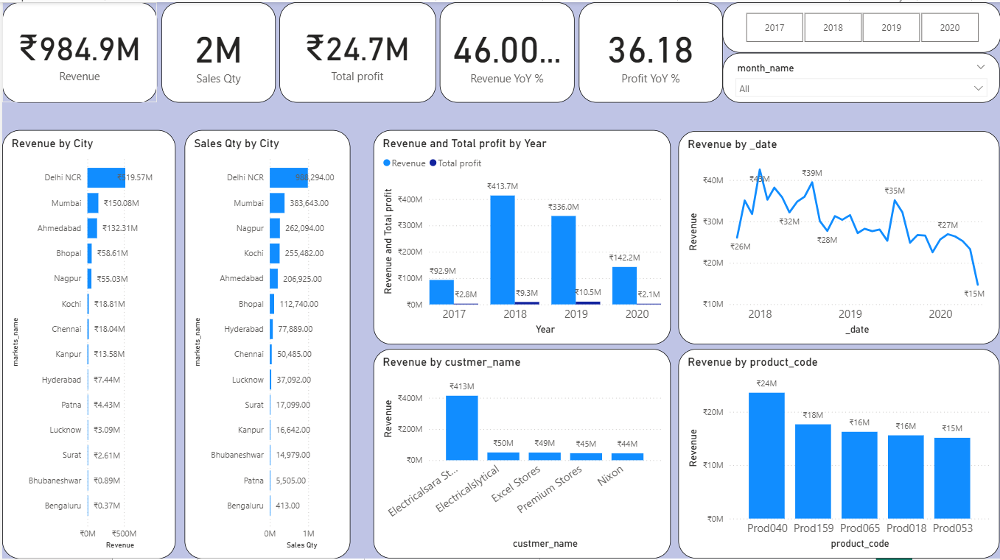

# Atliq Hardware Regions Sales Performance 
Sales analysis and reporting project for Atliq Hardware Sales Director across all regions using **SQL** and **Power BI**.
## Table of Contents
- [Overview](#overview)
- [Business Problem](#business-problem)
- [Dataset](#dataset)
- [Tools & Technologies](#tools--technologies)
- [Project Structure](#project-structure)
- [Exploratory Data Analysis (EDA)](#exploratory-data-analysis-eda)
- [Data Cleaning & Preparation](#data-cleaning--preparation)
- [Key Findings](#key-findings)
- [Dashboard](#dashboard)
- [How to Run This Project](#how-to-run-this-project)
- [Final Recommendations](#final-recommendations)
- [Author & Contact](#author--contact)

# Overview
This project focuses on analyzing and visualizing sales performance for Atliq Hardware across North, South, and Central zones, including their respective cities. It includes SQL scripts for database creation, EDA, and data preprocessing, as well as a Power BI dashboard for interactive insights. The goal is to streamline sales reporting, identify trends, track top-performing products and customers, and enable the Sales Director to make data-driven decisions without manually compiling multiple reports

# Business Problem
The Sales Director at Atliq Hardware needs a Power BI dashboard to monitor sales performance across different zones—North, South, and Central—and their respective cities. Currently, tracking and compiling separate sales reports for each zone is a time-consuming and exhausting manual process, making it difficult to quickly identify trends, compare regional performance, and drive timely decisions. The report period covered is 2017-2020


# Dataset
- Database dump located in `/data/database dump` folder
- SQL EDA and preprocessing located in `data/sql EDA and preprocessing` folder, can paste the query inside power query or preprocess data in power bi
- 

# Tools & Technologies
- **SQL** (EDA and preprocessing)
- **Power BI** (Interactive Visualizations and data preprocessing)


# Project Structure
```
Atliq Hardware Sales Performance/
├── data/
│   ├── database_dump_sql/              
│   │   ├── db_dump.sql
│   │   └── db_dump_version_2_with_cost_and_profit.sql
│   └── EDA_and_preprocessing/          
│       ├── EDA.sql
│       ├── Preprocessing.sql
│       └── top_5_products_by_years_and_sales_amount.sql
│
├── images/                             
├── dashboard/
│   └── atliq_project_powerbi.pbix      # Power BI dashboard file
│
├── Sales Director Report.pdf           # Final report
├── README.md                           # Project overview and instructions
├── .gitignore                          
                       

```


# Exploratory Data Analysis (EDA)
**transactions Table**
- this table has 281 duplicated records
- has negative and 0 sales amount
- currency table is INR but some record has USD
- converting USD to INR



```
-- this code shows that row_num > 1 means has duplicates
select * ,
row_number() over (partition by t.product_code , t.customer_code,
 t.market_code,t.order_date , t.sales_qty,t.sales_amount) as row_num
from sales.transactions as t
order by t.product_code
```
**date Table**
- this table has null record


**Same procedure has been followed with other tables to identify each table issues**


# Data Cleaning & Preparation
## all preprocessing can be made in power bi also as somde of the preprocessing done it power bi
- Insde `data/sql EDA and preprocessing` folder there some queries for for EDA and preprocessing the data that can be used or could transform data in power bi directly
```
-- sql query to deal with issues of transactions table

select * from (
select *,
case 
-- convert USD to INR
when t.currency in ('USD','USD\r') then t.sales_amount*75 
else t.sales_amount
end as sales_amount_filtered,
-- END of first preprocesing
-- ********************
-- adding row_num to show duplicates then selecting none duplicants row_num >1

row_number() over(
partition by t.product_code, t.customer_code, t.market_code, t.order_date, t.sales_qty,
t.sales_amount
order by  t.product_code
) as row_num
-- **** end of second preprocessing
from sales.transactions as t
-- ******************
-- selecting only amount > 0, since we have 0 and -1
where t.sales_amount > 0)  as New_Table
where New_Table.row_num = 1
```


# Key Findings
## Key Findings (2017–2020)
1. **Overall Performance**
- Total revenue ₹985M with 2M units sold, total profit ₹24.7M across four years.
- Peak revenue in 2018 (₹414M), but peak profit in 2019 (₹10.5M).
- Revenue declining after 2018; profit collapsed in 2020 (-66% YoY).
  
2. **Regional Insights**
- North: Highest sales, revenue share (~70%), and profit contribution but low profit margin (~2.2%).
- Central: Consistently highest profit margin (avg 3.3%), second in sales/revenue.
- South: Lowest sales/revenue but emerged in 2020 with top profit margin (5.8%).

3. **Customer & Profit Concentration**
- Top 5 customers contributed ~60% revenue on average, but their profit share declined from 82% → 50% (2017–2020).
- Top 25% customers generated ~70% revenue and profit share dropped from 93.5% → 74%, showing gradual profit diversification.
- Some non-top customers now provide strong profits despite lower sales.

4. **Negative Margin Issue**
- Cities like Bhubaneshwar, Hyderabad, Surat, Lucknow repeatedly show negative profit margins (sales price < cost).
  
5. **Product Trends**
- Products 53, 239, 65 consistently among top sellers, offering stable long-term demand.


# Dashboard



The **Power BI Dashboard** includes:
1. **Overview:** that has an overall summary of the whole analysi
2. **conversion_details:** has details of each zones : revenue,revenue contribution%, revenue YoY%, profit contribtion and profit YoY%
3. **profit / revenue contributions:**  this page goes indepth of each city within each zone, as well as highlights the negative profit cities
4. **Top 5 Customers:** track the profit and contributions of top 5 customers and YoY % changes of top 5 customers through years.
5. **new high profit contributers:**  using top 25% (P75) to see contributions of other than top 5 customers


# How to Run This Project

1. **Clone the repository**  

   git clone https://github.com/karrarhayderali/atliq-hardware-regions-sales-performance-sql-powerbi.git

2. **import database dump file**
   SQL `data/database dump/db_dump_version_2_with_cost_and_profit.sql`

3. **Run power**
   connect power bi to the database and import the tables
   transformations can be done in sql using SQL `data/sql EDA and preprocessing` files or import the queries inside power query

4. **Power bi dashboard will run normally**
   


## Final Recommendations

1. **Profitability Optimization**
- North Region: Improve pricing strategy, cost controls to lift margin above the modest 2.2%.
- South Region: Scale high-margin products and marketing to capitalize on its 5.8% profit margin despite low volume.
- Central Region: Replicate its operational efficiency in other regions to sustain healthy margins.
  
2. **Customer Strategy**
- Deepen relationships with Top 5 customers through premium offerings, but diversify dependence by nurturing high-profit smaller customers identified outside the Top 5.
- Use P75 analysis to target the next tier of high-profit customers.
  
3. **Pricing & Inventory**
- Address negative margin cities via pricing reviews, tighter cost controls, and inventory management (avoid clearance losses).

4. **Growth Focus**
- Prioritize profit growth over volume by promoting products and regions with higher margins (e.g., South’s high-margin items).
- Explore strategic marketing for stable top products (53, 239, 65) while testing new high-margin offerings.
  
5. **Monitoring**
- Track margin contribution vs. sales volume at customer and city levels to detect early signs of profitability risk or opportunity.


## Author & Contact
**Karar Haider – Data Analyst**  
📧 Email: [karrarhayderali@gmail.com](mailto:karrarhayderali@gmail.com)  
🔗 GitHub: [karrarhayderali](https://github.com/karrarhayderali)  
🔗 LinkedIn: [https://www.linkedin.com/in/karrar-hayder-33758a284](https://www.linkedin.com/in/karrar-hayder-33758a284)


